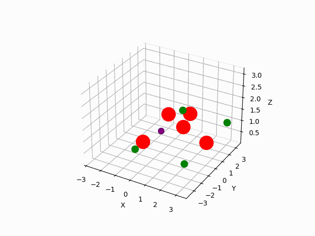

# Autonomous Drone Flight via Hierarchical Reinforcement Learning
This github repository contains the codebase for my master thesis on
Controlling Drones via Hierarchical Reinforcement Learning: A Study of Hierarchical Reinforcement Learning for autonomous drones

The thesis aims to test if HRL applied to the complex task of drone flight can help improve performance, adaptibility to environment pertubations and enhance multitask learning.

It tests PPO against PPOC on hovering, flying to waypoints and avoiding obstacles. In the animation below, you can see PPO and PPOC agents flying in an environment with obstacles. The 3d-rendering is not 100% accurate.

# Installing
Following software needs to be installed 
Python at least3.9.7 
C++ 14 for pybullet
Tested on Mac and Windows
Then installing via pip install -r requirements.txt, installs the further requirements. If you also want to plot 3d you need to install visvis, but I have only tested it on Mac. It might not work on another systems. Install it via pip install visvis and install glfw via pip install glfw.

# Available agents
In general two agents are available PPO and PPOC. For the experiments in this thesis PPO was used from stable-baselines3. However, there is also a slightly adapted version, utilizing stable-baselines code added, which was used to understand implementation details for the PPOC. I recommend running directly the stable-baselines3 versions, which are also specified in the training files.

#### Training ppo
Training of the PPO is done in the train_ppo.py file. You can choose between the different environments and different number of training episodes by giving the command line arguments --environment - total_timesteps. Environments are named after PyFlyt. For example hover QuadX-Hover-v1/QuadX-Obstacles-v1/QuadX-Waypoints-v1
Automatically checkpoints are taken and monitor wrappers are added. In environment with waypoints, the monitor also includes the num of waypoints reached per episode

#### Training ppo transfer
Training transfer is done in a separate file train_transfer.py. Otherwise the same applies as the normal training. However, the environment can only be "Transferlearning_Waypoint_Obstacle" for 

#### Training PPOC transfer
PPOC can be trained by execution the file train_ppoc.py. THe same arguments can be used as for PPO.

#### Plotting experiment results
Graphs can be plotted in the jupyter notebook plot_graphs.ipynb. However, they require to run experiments training before. After the training the monitor paths or the log files have to be added to the corresponding lists. For plotting the 3d graphis for point sampling use the file point_sampling.ipynb

#### Plotting trajectories
If visvis is installed. Trajectories can be plotted by executing. For this a trajectory file has to be provided. trajectories can be obtained by taking in evaluation run the x,y and z variables from the aviary under the environment.